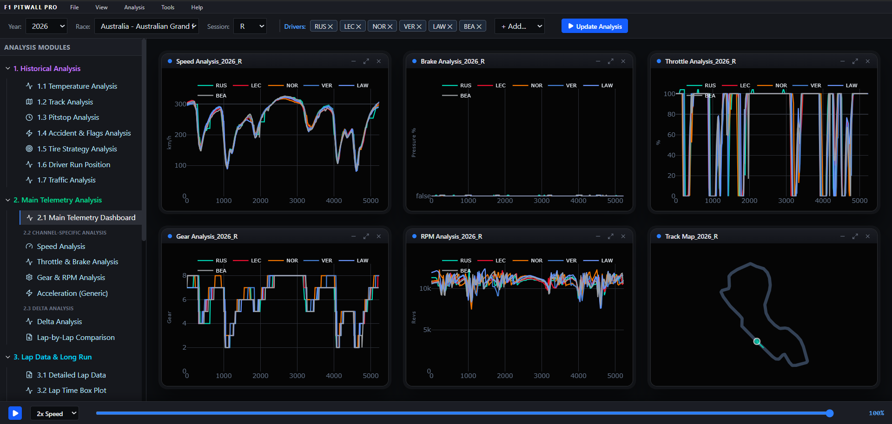
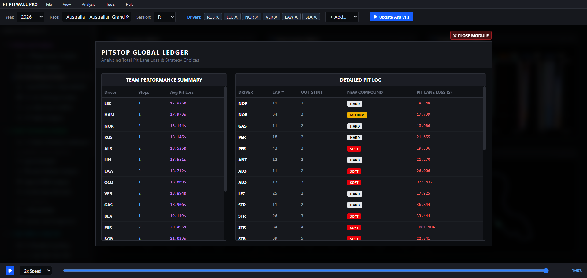
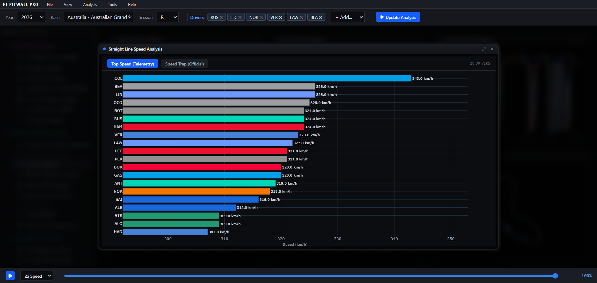
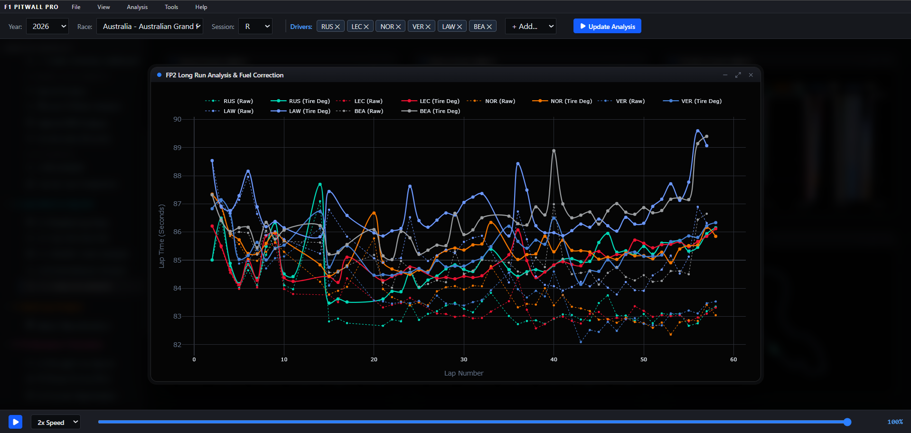
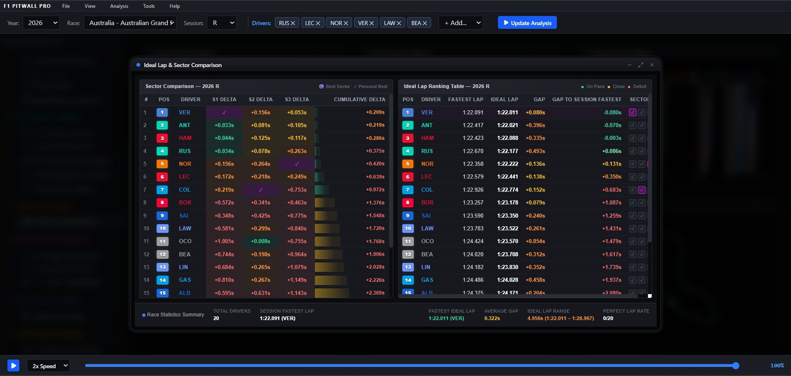
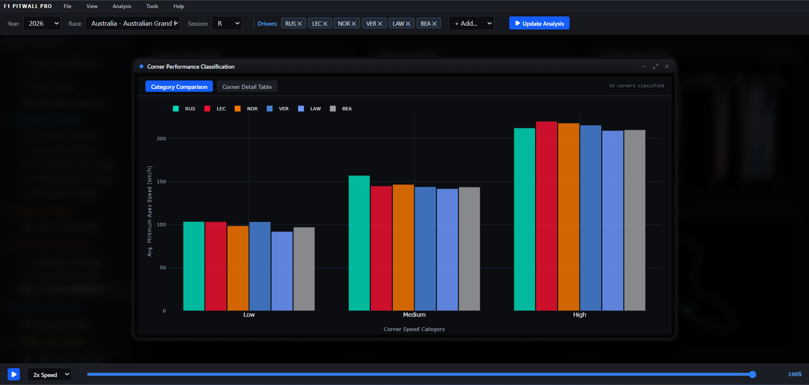
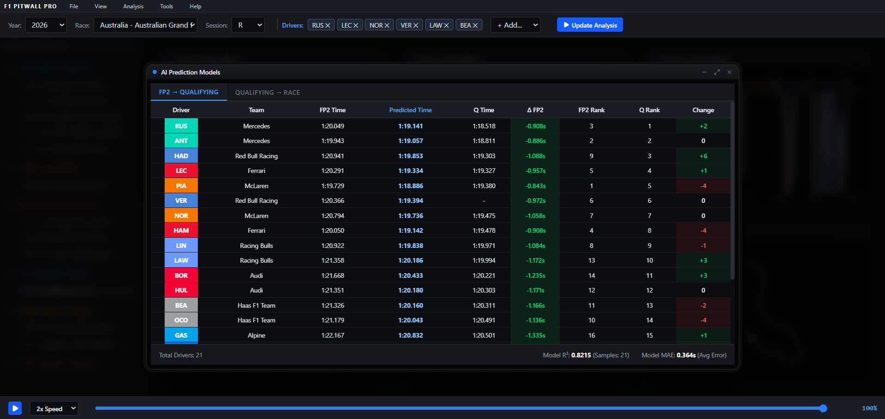
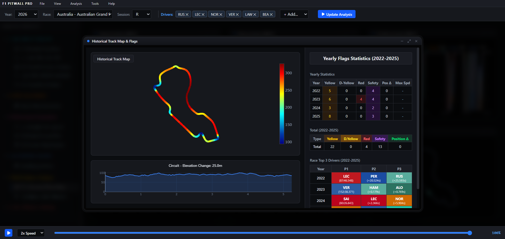

# 🏎️ F1 Pitwall Pro


**F1 Pitwall Pro** is an elite, multi-document web framework designed for high-performance Formula 1 telemetry analysis. It integrates a sleek, desktop-class UI within the browser to provide real-time strategic insights, temporal driver tracking, and deep-dive statistical comparisons across historical F1 events.



---

## ⚡ Core Architecture

- **Multi-Document Interface (MDI):** Interactive, draggable, and stackable window cards allowing engineers to monitor limitless concurrent data vectors on a single screen.
- **Synchronized Telemetry Playback Engine:** A global temporal playback slider that aligns all independent analysis windows (Speed, RPM, Gear, Throttle, Brake pressure) to the precise distance marker across multiple drivers simultaneously.
- **Dynamic Track Overlay:** Granular scatter-plot visual representations of the race circuit with dynamic marker-tails, calculating multi-car relative positions simultaneously.
- **Resilient Memory Caching:** Custom Python `FastF1` backend is bulletproofed against F1 Live Timing API throttles and securely buffers active Grand Prix data arrays deep in memory to achieve instantaneous UX plotting velocities.

---

## 🏁 The 8-Pillar Analytics Suite

F1 Pitwall Pro is meticulously organized into 8 overarching analysis categories, mirroring true trackside engineering environments.

---

### 🟣 1. Historical Analysis
This group contains deep post-race analysis tools, covering strategy, tires, incidents, and track/environmental context.



* **1.1 Temperature Analysis:** Visualizes environmental data throughout the race weekend (Track Temp, Air Temp, humidity, pressure, rainfall).
* **1.2 Track Analysis:** Renders a high-precision circuit map labeling all official corner numbers and DRS zones.
* **1.3 Pitstop Analysis:** Detailed pitstop analytics with team summary and detailed log. Calculates stationary time and total pit loss.
* **1.4 Accident & Flags Analysis:** Focuses on interruptions (Yellow Flag, Red Flag, VSC, SC) on a Gantt-chart-style timeline.
* **1.5 Tire Strategy Analysis:** The core module for analyzing tire usage strategy using intuitive horizontal stint bars for each driver.
* **1.6 Driver Run Position:** Plots a position chart for the entire race, keeping position calculations correct for DNFs.
* **1.7 Traffic Analysis:** Quantifies traffic conditions encountered during the race to determine clean vs. dirty air.

---

### 🟢 2. Main Telemetry Analysis
This group provides sample-rate (Hz) vehicle physics data analysis for precise comparisons of driving style and car performance.



* **2.1 Main Telemetry Analysis:** The most powerful telemetry tool in the system. Synchronized display of Speed, RPM, Gear, Throttle, Brake, and DRS status.
* **2.2 Channel-Specific Analysis:** Deeper views for specific signals (Speed, Brake, Throttle, Gear & RPM, Acceleration).
* **2.3 Delta Analysis:** Directly computes speed differences between two cars at the same track position to show who is faster in corners/straights.

---

### 🩵 3. Lap Data & Long Run
This group focuses on statistical lap-time characteristics, consistency, and long-run performance.



* **3.1 Detailed Lap Data:** Feature-rich table listing detailed information for every lap of selected drivers.
* **3.2 Lap Time Box Plot:** Uses a box-and-whisker plot to visualize lap-time distribution, showing median, IQR, and outliers.
* **3.3 Throttle Corner Analysis:** Combines throttle data with track corners to evaluate driver confidence and corner-exit application.
* **3.4 Pedal Behavior Analysis:** Presents the pedal usage status distribution (Throttle Only, Brake Only, Trail Braking, Coasting).
* **3.5 Long Run Analysis:** Designed for FP2 long-run simulation analysis, including fuel correction to isolate pure tire degradation rate.

---

### 🟠 4. Ideal Lap Analysis
This group reconstructs best sector times to explore theoretical performance limits.



* **Sector Reconstruction:** Computes each driver’s theoretical best lap time by summing their best S1, S2, and S3 from the session. Compares theoretical time with actual pole time to calculate the "potential gap".

---

### 🩷 5. Performance Evaluation
Deep-dive car characteristic benchmarking.



* **5.1 Straight Line Speed:** Collects and compares top speed/trap speed at key straight endpoints, reflecting drag level and engine power.
* **5.2 Brake & Acceleration Performance:** Uses scatter plots to analyze deceleration performance in heavy braking zones and corner-exit acceleration.
* **5.3 Corner Performance Classification:** Classifies corners by speed into low-speed, medium-speed, and high-speed categories.

---

### 🔵 6. AI Prediction Models
Machine learning driven race forecasting.



* **Qualifying & Race Predictions:** Algorithmic gap-prediction utilizing FP data to forecast Qualifying pace and Race finishing distributions.

---

### 🟡 7. Multi-Season Analysis
Year-over-year circuit evolution.



* **7.1 Historical Track Map:** Combines a track map, elevation chart, and year-by-year flag statistics table to analyze incident hotspots.
* **7.2 Season Start Reaction:** Focuses on drivers’ start performance across the season using 0–50 km/h acceleration time distributions.

---

### 🔴 8. Live Timing & Strategy (Planned)
*The future frontier for real-time race weekend integration.*

* **8.1 Core Monitoring:** Ranking Tower, Track Map, Circle Map, Track & Weather.
* **8.2 Strategy & Prescription:** Driver Strategy, Battle Insight, Chase Strategy, Pit Window, Tyre Strategy.
* **8.3 Telemetry & Performance:** Real-time Telemetry Traces, Sector Comparison, SF% History, Top Speed History.
* **8.4 History & Stats:** Lap History Tables, Lap Time Distribution, Live Traffic Timeline, Traffic Distance.
* **8.5 Others:** Race Control messages.

---

## 🛠️ Technology Stack

### Frontend (Visual Layer)
* **React.js (Vite):** Core interface construction and component state lifecycle.
* **Tailwind CSS:** Fully customized, high-density brutalist data engineering aesthetics (`#0b0d10` deep-dark UI patterns).
* **Plotly.js:** Mathematical charting algorithms rendering vast float arrays flawlessly.
* **Lucide React:** Minified, razor-sharp UI iconography.

### Backend (Telemetry Engine)
* **Python 3.10+ / FastAPI:** High-throughput JSON microservices handling intense algorithmic requests from the browser.
* **FastF1 & Pandas:** Under-the-hood F1 database querying, fetching millions of raw sensor traces and orchestrating temporal alignments seamlessly.
* **Async Threading:** Secure background loading parameters to maintain responsive interfaces while fetching 50MB+ car tracking traces.

---

---

## 🚀 Installation & Directives

### 🐳 Option A: Docker Deployment (Recommended)
The easiest way to run the entire suite with persistent caching and pre-configured networking:
```bash
# Start the entire stack in detached mode
docker-compose up -d --build

# Access the dashboard at http://localhost
```

### 🐍 Option B: Manual Installation

#### 1. Backend Spin-Up (Python)
First, ensure your device has Python installed, then map the dependencies:
```bash
# Navigate to the workspace
cd backend

# Install computational dependencies
pip install -r requirements.txt

# Ignite the FastAPI Engine (Runs on PORT 8001)
python app.py
```

#### 2. Frontend Launch (Vite/React)
In a secondary terminal window, activate the visual layer:
```bash
cd frontend

# Map Node parameters
npm install

# Deploy to local hot-reload server
npm run dev
```

---

## 🔧 Architecture & Commands

- **Data Slicing Mechanisms:** `App.jsx` handles core logic, looping down the `distance` arrays and injecting them into the `TrackMap.jsx` and `LineChart.jsx` dependencies dynamically aligned with the native `<PlaybackControls />`.
- **System Hard-Reset:** If the F1 Live Timing network fails mid-download, use the **`Analysis > Clear Telemetry Cache`** file menu operation. This pushes a REST execution packet to the python backend to dump its locked threading memory and force a fresh fetch loop.

---

*This application assumes connection to active internet pipelines to securely stream telemetry metadata natively off external Formula 1 telemetry provider nodes.*
