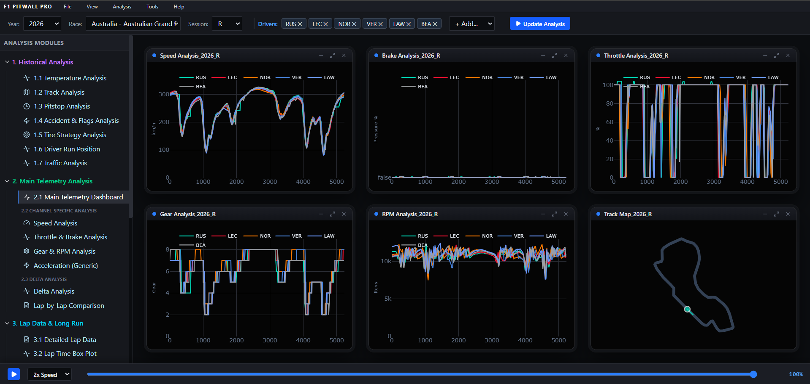
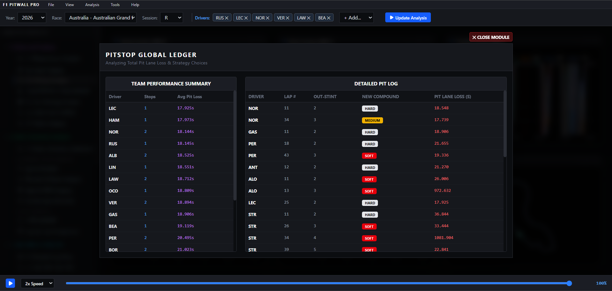
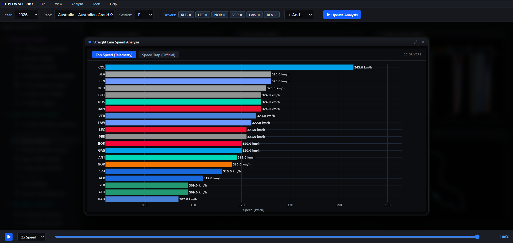
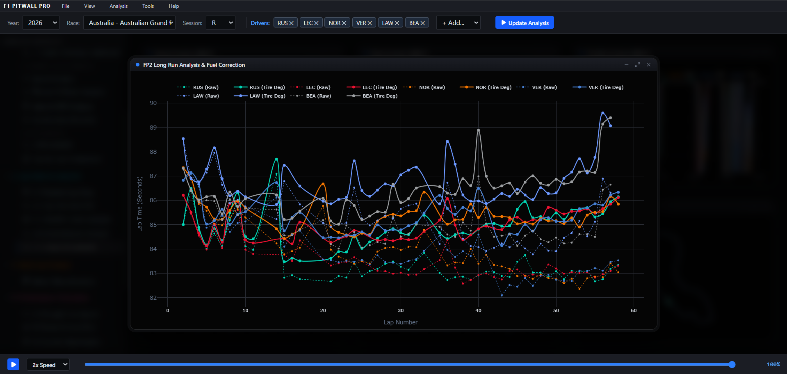
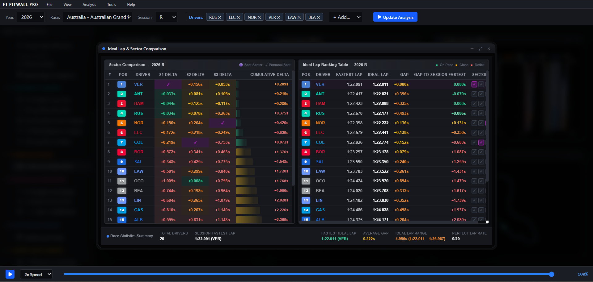
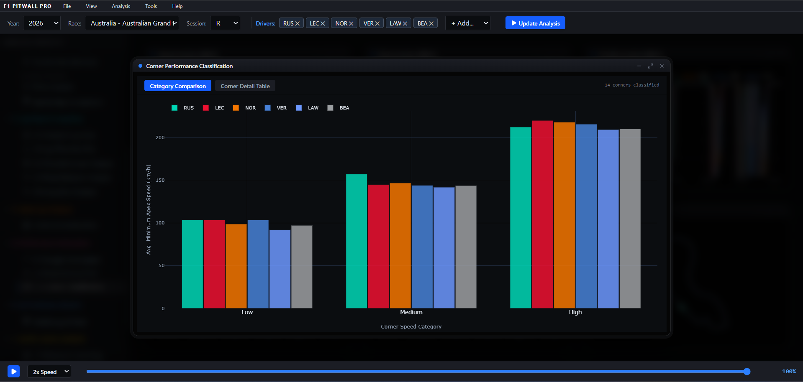
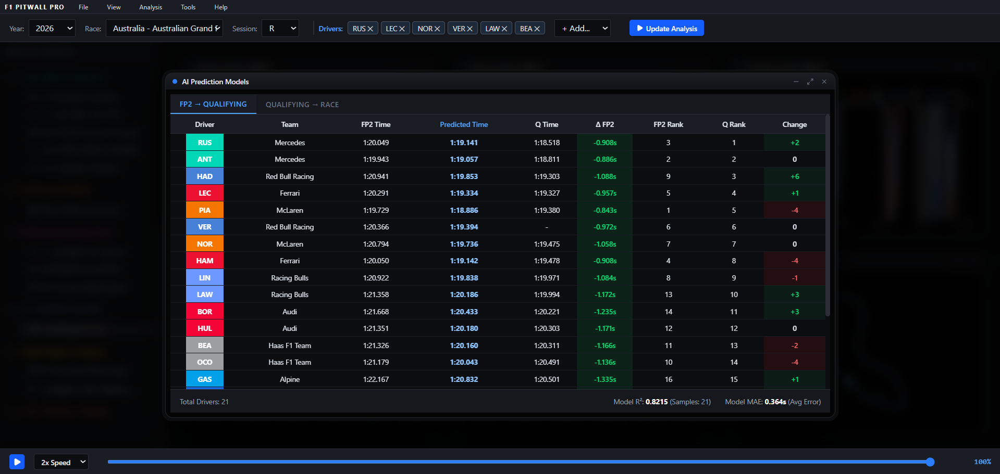
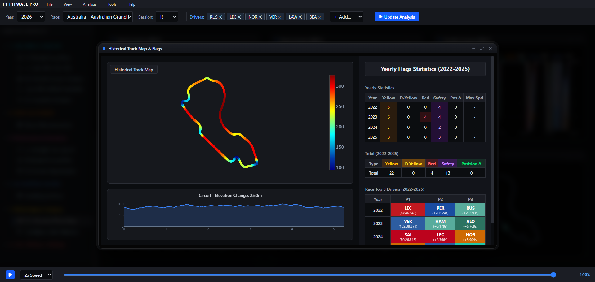

# 🏎️ F1 Pitwall Pro


**F1 Pitwall Pro** is an elite, multi-document web framework designed for high-performance Formula 1 telemetry analysis. It integrates a sleek, desktop-class UI within the browser to provide real-time strategic insights, temporal driver tracking, and deep-dive statistical comparisons across historical and live F1 events.



---

## ⚡ Core Architecture

- **Multi-Document Interface (MDI):** Interactive, draggable, and stackable window cards allowing engineers to monitor limitless concurrent data vectors on a single screen.
- **Synchronized Telemetry Playback Engine:** A global temporal playback slider that aligns all independent analysis windows (Speed, RPM, Gear, Throttle, Brake pressure) to the precise distance marker across multiple drivers simultaneously.
- **Dynamic Track Overlay:** Granular scatter-plot visual representations of the race circuit with dynamic marker-tails, calculating multi-car relative positions simultaneously.
- **AI-Powered Insights:** Integrated **Groq LLaMA 3.3** engine for natural language race strategy queries and performance auditing.
- **Resilient Memory Caching:** Custom Python `FastF1` backend is bulletproofed against F1 Live Timing API throttles and securely buffers active Grand Prix data arrays deep in memory to achieve instantaneous UX plotting velocities.

---

## 🏁 The 8-Pillar Analytics Suite

F1 Pitwall Pro is meticulously organized into 8 overarching analysis categories, mirroring true trackside engineering environments.

---

### 🟣 1. Historical Analysis
Post-race analysis tools covering strategy, tires, incidents, and environmental context.



* **1.1 Temperature Analysis:** Visualizes environmental data (Track/Air Temp, humidity, pressure, rainfall).
* **1.2 Track Analysis:** High-precision circuit map with corner numbering and DRS zones.
* **1.3 Pitstop Analysis:** Detailed stationary time analytics and total pit loss logs.
* **1.4 Pit Strategy Gantt:** Visualizes the entire race strategy timeline in a Gantt format.
* **1.5 Accident & Flags Analysis:** Interruption timeline (Yellow/Red Flags, VSC, SC).
* **1.6 Tire Strategy Analysis:** Core module for analyzing tire usage and stint lengths.
* **1.7 Driver Run Position:** Race-long position tracking including DNF logic.
* **1.8 Traffic Analysis:** Quantifies clean vs. dirty air metrics.

---

### 🟢 2. Main Telemetry Analysis
High-frequency vehicle physics data for precise driving style comparisons.



* **2.1 Main Telemetry Dashboard:** Synchronized Speed, RPM, Gear, Throttle, Brake, and DRS.
* **2.2 Channel-Specific Analysis:** Focused views for specific physics signals and acceleration.
* **2.3 Delta Analysis:** Direct distance-based speed and time delta computation between drivers.
* **2.4 Lap-by-Lap Comparison:** Side-by-side telemetry comparison for specific selected laps.
* **2.5 Lap Delta Overlay:** Visualizes time gaps vs. distance with a corresponding track map.
* **2.6 Sector Comparison Chart:** Visual breakdown of performance across all timing sectors.

---

### 🩵 3. Lap Data & Long Run
Statistical lap-time characteristics, consistency, and degradation analysis.



* **3.1 Detailed Lap Data:** Comprehensive information matrix for every session lap.
* **3.2 Lap Time Box Plot:** Statistical distribution of lap times (Median, IQR, Outliers).
* **3.3 Weather-Correlated Pace Analysis:** Maps performance windows against fluctuating temperatures.
* **3.4 Throttle Corner Analysis:** Evaluates driver confidence and corner-exit application.
* **3.5 Pedal Behavior Analysis:** Distribution of Throttle/Brake/Trail-Braking/Coasting states.
* **3.6 Long Run Analysis:** FP2 simulation analysis with fuel-load correction.
* **3.7 Tyre Degradation:** Stint-aware degradation curve modeling.

---

### 🟠 4. Ideal Lap Analysis
Reconstructs best sector times to explore theoretical performance limits.



* **4.1 Ideal Lap Ranking:** Aggregates best sectors into a "potential" qualifying leaderboard.
* **4.2 Sector Mini-Splits:** High-resolution track map color-coded by sector ownership.
* **4.3 Theoretical Fastest Lap:** Combines personal best sectors into a fantasy "perfect lap".

---

### 🩷 5. Performance Evaluation
Deep-dive car characteristic benchmarking and driver style signatures.



* **5.1 Straight Line Speed:** Top speed and trap speed benchmarking at key straight endpoints.
* **5.2 Brake & Accel Performance:** Scatter-plot analysis of deceleration and corner-exit traction.
* **5.3 Corner Performance Classification:** Categorizes performance across Low/Medium/High speed corners.
* **5.4 Corner Analysis Mode:** High-fidelity deep dive into specific turn-by-turn performance.
* **5.5 Driver Style Fingerprint:** **[NEW]** Radar chart visualizing 5 key personality metrics: Consistency, Braking Aggression, Throttle Commitment, Cornering G-Force, and Top Speed.

---

### 🔵 6. Strategy & Predictions
Machine learning driven race forecasting and interactive simulation.



* **6.1 AI Prediction Models:** Algorithmic forecasting for Qualifying pace and Race finishing orders.
* **6.2 AI Race Strategist:** Interactive race engineering assistant powered by **Groq LLaMA 3.3**.
* **6.3 What-If Strategy Simulator:** Interactive tool to simulate "what if" pit stop and strategy scenarios.

---

### 🟡 7. Multi-Season Analysis
Year-over-year circuit evolution and historical trends.



* **7.1 Historical Track Map:** Multi-year track map combining elevation and incident statistics.
* **7.2 Season Start Reaction:** Analyzes 0–50 km/h launch performance across the calendar.

---

### 🔴 8. Live Timing & Strategy
Real-time race weekend integration and communications.

* **8.1 Team Radio Player:** **[NEW]** Integrated radio transmission browser with distance-synced playback.
* **8.2 Planned Modules:** Ranking Tower, Live Circle Map, Chase Strategy, Battle Insights, and SF% History.

---

## 🛠️ Technology Stack

### Frontend (Visual Layer)
* **React.js 19 (Vite):** Core interface construction and component state lifecycle.
* **Tailwind CSS 4.0:** Fully customized, high-density brutalist data engineering aesthetics (`#0b0d10`).
* **Plotly.js:** Mathematical charting algorithms rendering vast float arrays.
* **Lucide React:** Minified, razor-sharp UI iconography.

### Backend (Telemetry Engine)
* **Python 3.12 / FastAPI:** High-throughput JSON microservices.
* **FastF1 & Pandas:** Telemetry querying and temporal alignment orchestration.
* **Groq SDK:** High-speed inference for the AI Race Strategist.
* **AssemblyAI:** Future-ready transcription capabilities for team radio analysis.

---

## 🚀 Installation & Directives

### 🐳 Option A: Docker Deployment (Recommended)
```bash
# Start the entire stack in detached mode
docker-compose up -d --build

# Access the dashboard at http://localhost
```

### 🐍 Option B: Manual Installation

#### 1. Backend Spin-Up (Python)
```bash
cd backend
pip install -r requirements.txt
python app.py
```

#### 2. Frontend Launch (Vite/React)
```bash
cd frontend
npm install
npm run dev
```

---

## 🔧 Architecture & Commands

- **Temporal Synchronization:** All charts and maps subscribe to a global distance state, ensuring that moving the slider in one window updates the position marker in all others.
- **Memory Hot-Reload:** Use **`Analysis > Clear Telemetry Cache`** to force the backend to dump its memory lock and re-fetch session data from the provider.

---

*This application assumes connection to active internet pipelines to securely stream telemetry metadata natively off external Formula 1 telemetry provider nodes.*
